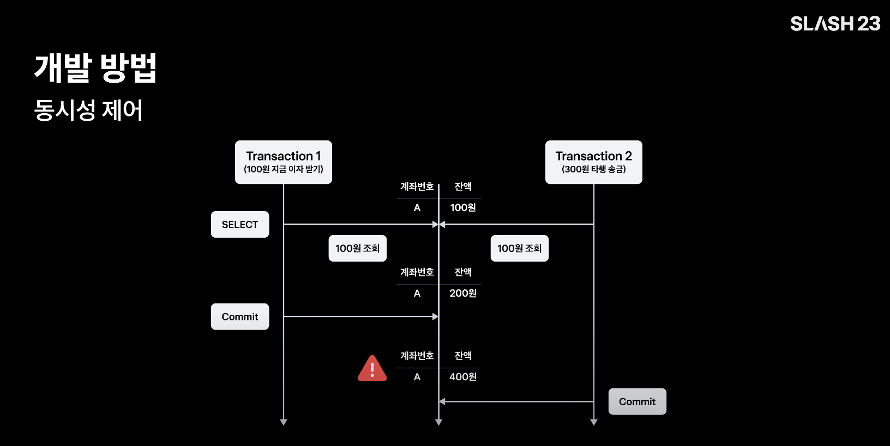
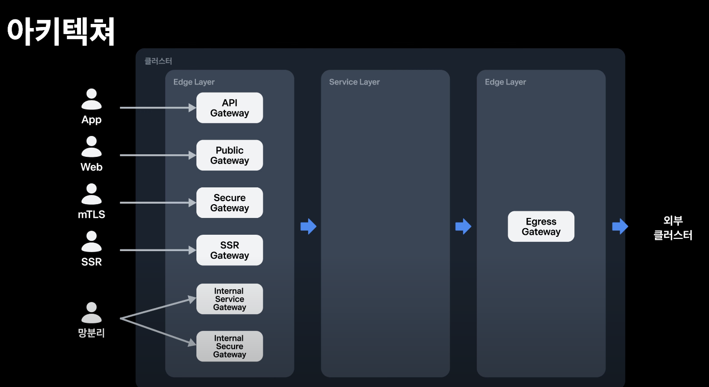
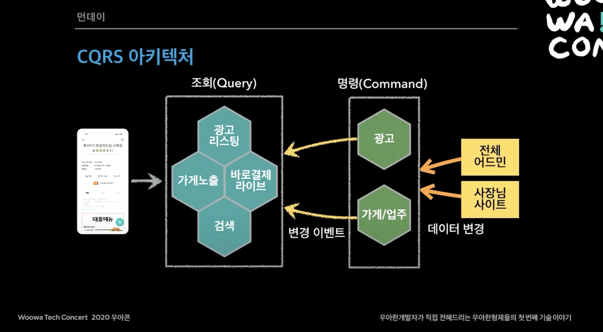
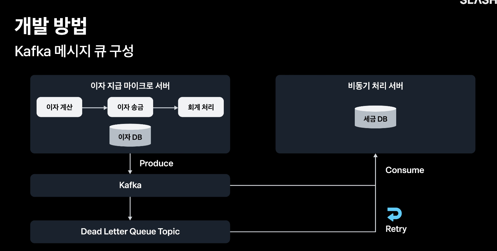

# 마이크로서비스 아키텍처(MSA) 에 대해

## 서론

마이크로서비스 아키텍처에 대해 들어본 적이 있나요? 
저는 채용공고를 살펴보던 중 많은 기업이 마이크로서비스 아키텍처에 대한 이해와 경험을 요구하고 있다는 것을 알게 되었습니다.

사실 취업 준비생인 우리가 마이크로서비스 아키텍처를 직접 경험해볼 기회는 많지 않습니다.
대부분의 프로젝트나 규모가 크지 않은 기업은 여전히 모놀리식 아키텍처를 채택해 서비스를 설계하고 운영하는 경우가 많습니다.

그래서 이번 글에서는 마이크로서비스 아키텍처가 무엇인지, 왜 많은 기업이 이를 도입하려고 하는지에 대해 알아보려고 합니다.

## 등장배경

마이크로서비스 아키텍처의 등장배경을 이해하려면 먼저 기존의 모놀리식 아키텍처를 살펴볼 필요가 있습니다.

모놀리식 아키텍처는 하나의 대형 애플리케이션을 단일 코드베이스로 관리하는 방식입니다.

모놀리식 아키텍처를 이해하기 쉽게, 간단한 블로그 애플리케이션을 예시로 들어보겠습니다.
하나의 블로그 애플리케이션을 운영한다고 가정해봅시다. 이 애플리케이션은 다음과 같은 기능들을 포함합니다.

- 사용자 관리: 회원가입, 로그인, 권한 관리  
- 게시물 작성: 글 쓰기, 수정, 삭제  
- 댓글 기능: 각 게시물에 대한 댓글 작성 및 관리  
- 알림 기능: 댓글이 달리면 사용자에게 알림 발송  
- 통계 기능: 방문자 수, 조회 수 등 블로그 통계 제공

모놀리식 아키텍처에서는 위의 모든 기능이 하나의 코드베이스로 구성되어 있습니다. 
즉, 하나의 프로젝트에 모든 기능이 포함되며 데이터베이스 접근, 비즈니스 로직 등이 하나로 얽혀있습니다.

작은 블로그 프로젝트에서 처음에 이 방식은 간단하게 관리할 수 있고, 문제가 되지 않을 수 있지만 시간이 지남에 따라 기능이 점점 늘어나고 사용자가 많아질수록 시스템의 복잡도는 급격하게 증가합니다. 
때문에 다음과 같은 문제들이 발생합니다.

1. 배포의 어려움  
   댓글 기능에 작은 버그가 생겼다고 가정해봅시다. 이 버그를 수정한 후 배포하려면 블로그 애플리케이션 전체를 다시 빌드하고 배포해야 합니다. 
   댓글 기능만 수정했지만 관련 없는 다른 기능까지 모두 함께 배포해야 하므로 불필요한 리스크와 시간이 발생하게 됩니다.

2. 확장성 문제  
   특정 시간대에 로그인과 같은 사용자 관리 기능에 요청이 집중되면서 서버 부하가 증가할 수 있습니다. 이때 모놀리식 아키텍처에서는 애플리케이션 전체를 확장해야 합니다. 
   즉, 댓글 기능이나 알림 기능과는 관계없이 서버 전체에 리소스를 추가로 할당해야 하므로 비효율적입니다.

3. 복잡성 증가  
   새로운 기능을 추가할 때마다 코드베이스가 복잡해집니다. 예를 들어 알림 기능을 추가하려면 기존 사용자 관리, 게시물 관리, 댓글 기능과의 통합을 고려해야 하고 혹시나 잘못 수정할 경우 다른 기능들이 동작하지
   않거나 충돌이 발생할 수 있습니다.

4. 기술 스택의 제한  
   모놀리식 아키텍처에서는 새로운 기술을 도입하려고 해도 애플리케이션 전체가 기존 기술 스택에 강하게 의존하기 때문에 큰 제약이 따릅니다. 
   예를 들어 블로그 통계 기능에 새로운 빅데이터 분석 도구를 추가하고 싶더라도 기존 애플리케이션의 다른 부분들과 호환성을 맞추기 위해 프로젝트 전체를 수정해야 할 수 있어 도입이 어려워집니다.

이런 문제들이 반복되다 보면 대규모 서비스나 빈번한 업데이트가 필요한 환경에서는 모놀리식 아키텍처의 관리와 운영에 불편함이 많아집니다.

이러한 한계를 극복하기 위해 시스템을 보다 유연하게 관리할 수 있는 대안으로 마이크로서비스 아키텍처가 등장했습니다. 
특히 애자일 방법론의 확산과 클라우드 컴퓨팅, 컨테이너와 같은 분산형 인프라의 발전 덕분에 마이크로서비스 아키텍처가 더 주목받게 되었습니다.

## 마이크로서비스 아키텍처란?

마이크로서비스 아키텍처는 애플리케이션을 여러 개의 작은 독립적인 서비스로 나누어 각각의 서비스가 특정 기능만 담당하도록 설계합니다.

예를 들어, 블로그 애플리케이션에서는 사용자 관리, 게시물 작성, 댓글 관리, 알림 서비스, 통계 서비스 등으로 분리할 수 있습니다. 
각 서비스는 독립적으로 개발, 배포, 확장할 수 있어 기존 모놀리식 아키텍처에서의 문제를 해결할 수 있습니다.

마이크로서비스의 주요 특징은 다음과 같습니다.

1. 독립적인 배포  
   각 서비스는 독립적으로 배포될 수 있어 애플리케이션 전체를 다시 빌드하고 배포할 필요가 없습니다. 
   예를 들어 댓글 서비스에 문제가 생기면 댓글 서비스만 수정하고 배포하면 됩니다.

2. 확장성  
   마이크로서비스 아키텍처는 특정 서비스만 확장할 수 있습니다. 만약 로그인 요청이 증가하면 사용자 관리 서비스만 확장하면 되고, 다른 서비스는 확장할 필요가 없습니다. 
   이로 인해 자원을 효율적으로 사용할 수 있습니다.

3. 다양한 기술 스택 사용  
   각 서비스는 서로 다른 기술 스택을 사용할 수 있습니다. 예를 들어, 통계 서비스는 빅데이터 처리를 위해 특화된 기술을 사용하고 댓글 서비스는 가벼운 REST API 기반으로 구현할 수
   있습니다.

4. 빠른 배포와 유연성  
   각 팀이 특정 서비스에 집중할 수 있어 개발 및 배포 속도가 빨라집니다. 또한 장애가 발생하더라도 문제가 있는 서비스만 독립적으로 수정할 수 있어 전체 시스템의 안정성을 높일 수 있습니다.

## 모놀리식 vs 마이크로서비스

지금까지 마이크로서비스 아키텍처의 등장배경을 모놀리식 아키텍처의 단점을 보완하는 측면에서 설명했지만 사실 두 아키텍처는 각각의 장단점이 있습니다. 
따라서 자신의 환경과 서비스에 맞춰 신중하게 선택하는 것이 중요합니다.

참고로 “마이크로서비스 아키텍처를 도입했다가 실패했다”는 사례를 자주 볼 수 있습니다. 
이는 어떤 아키텍처나 기술 스택을 도입하더라도 자신의 상황에 맞춰 충분한 고려가 필요하다는 점을 알 수 있습니다.

### 모놀리식 아키텍처

- 장점 
  - 단순한 개발과 배포: 처음에는 구조가 단순해서 하나의 코드베이스로 전체 시스템을 관리할 수 있습니다. 
    때문에 배우기 쉽고 빠르게 개발과 배포를 진행할 수 있습니다. 
  - 낮은 운영 비용: 하나의 애플리케이션으로 모든 기능을 제공하므로 운영 비용이 상대적으로 적습니다. 
  - 효율적인 디버깅: 전체 시스템이 하나의 애플리케이션 안에 있어 디버깅과 테스트가 일관되고 쉽습니다.
- 단점 
  - 배포 시 어려움: 작은 수정에도 전체 애플리케이션을 재배포해야 하는 상황이 발생할 수 있습니다. 
  - 확장성 부족: 특정 기능만 확장하기 어렵고 시스템 전체를 확장해야 하므로 비효율적입니다. 
  - 복잡성 증가: 시스템이 커질수록 코드베이스 관리가 어려워지고 유지보수와 확장이 복잡해집니다.

### 마이크로서비스 아키텍처

- 장점 
  - 독립적인 배포: 특정 기능만 업데이트하거나 수정하는 상황에서 업데이트 된 서비스만 독립적으로 배포할 수 있습니다. 
  - 확장성: 특정 서비스만 확장할 수 있으므로 자원을 효율적으로 사용할 수 있습니다. 
  - 기술 선택 시 자율성: 각 마이크로서비스는 독립적으로 기술 스택을 선택할 수 있어 상황에 맞는 기술을 사용할 수 있습니다. 
  - 팀 간 협업: 개발팀이 각 서비스별로 독립적으로 운영할 수 있어 팀 간 협업의 부담이 줄어듭니다.
- 단점
  - 복잡한 인프라 관리: 마이크로서비스는 각 서비스가 독립적으로 운영되므로 인프라 관리가 복잡해지고 서비스 간 통신을 관리해야 합니다. 
  - 데이터 일관성 문제: 여러 서비스가 분리되어 운영되기 때문에 데이터 일관성을 유지하기 어렵습니다. 
  - 초기 도입 비용: 마이크로서비스 아키텍처 도입 초기에는 서비스 분리와 인프라 구축에 시간이 많이 소요되며 복잡도가 증가할 수 있습니다.

## 작은 규모의 프로젝트에 적합한 아키텍처

작은 규모의 프로젝트는 기능이 적고 사용자 수가 많지 않기 때문에 모놀리식 아키텍처가 더 적합합니다. 
초기 개발 속도가 빠르고 유지보수와 운영에 대한 부담이 적으며 비용도 적게 듭니다. 규모가 크지않은 팀이 개발하는 환경에서는 모놀리식 아키텍처가 효율적입니다.

## 대규모 서비스나 빈번한 업데이트가 필요한 환경에서 적합한 아키텍처

대규모 서비스에서는 다양한 기능이 독립적으로 운영되어야 하고 각 팀이 독립적으로 작업할 수 있는 환경이 필요합니다.
또한, 시스템 확장 시 특정 서비스만 확장할 수 있는 유연성이 중요합니다.
빈번한 업데이트가 필요한 환경에서는 각 서비스가 독립적으로 배포되므로 다른 서비스에 영향을 주지 않고 빠르게 새로운 기능을 추가하거나 버그를 수정할 수 있습니다. 
때문에 마이크로서비스 아키텍처가 유리합니다.

## 마이크로서비스 아키텍처 도입 시 고려사항

1. 초기 복잡성: 마이크로서비스 아키텍처를 도입하려면 서비스 분리, API 통신, 데이터베이스 분산, 배포 자동화 등 많은 준비가 필요합니다.

2. 운영 비용 증가: 여러 개의 서비스가 독립적으로 운영되기 때문에 인프라 관리와 모니터링 비용이 증가할 수 있습니다.

3. 데이터 일관성: 분산된 서비스 간 데이터 동기화 문제를 해결해야 합니다. 이를 해결하기 위해 CQRS 패턴이나 이벤트 소싱 등의 복잡한 아키텍처가 필요할 수 있습니다.

## 마이크로서비스 아키텍처 도입을 위한 기술 스택

마이크로서비스 아키텍처는 서비스가 독립적으로 개발, 배포, 운영되는 구조이기 때문에 이를 지원하기 위한 몇 가지 기술 스택이 필요합니다.

1. 서비스 간 통신 관리를 위한 API 게이트웨이  
   마이크로서비스 아키텍처에서는 수십 개의 마이크로서비스가 각기 다른 기능을 수행하며 클라이언트 요청에 대응합니다. 
   이때 API 게이트웨이는 중개자 역할을 하여 클라이언트의 요청을 일괄적으로 관리하고 라우팅합니다. 
   이를 통해 마이크로서비스는 클라이언트와 독립적으로 확장할 수 있으며 보안 및 모니터링을 위한 단일 제어 지점을 제공합니다.
    - 대표적인 기술 : Kong, Spring Cloud Gateway, Nginx
   

참고) 토스에서는 서비스 수가 적고 트래픽이 낮을 때는 클라이언트가 각 서비스를 직접 호출하고 모든 로직을 처리해도 큰 부담이 없었으나 서비스가 성장하고 서버 수가 많아지면서 기존 방식으로는 관리가 힘들어졌다고 합니다. 
이를 해결하기 위해 목적에 맞는 API 게이트웨이를 개발하여 사용하고 있고, 현재는 Spring Cloud Gateway 사용하고 있다고 합니다.

2. 동적 서비스 위치 관리를 위한 서비스 디스커버리  
   마이크로서비스 아키텍처에서는 서비스들이 독립적으로 배포되기 때문에 IP 주소나 포트가 수시로 변경될 수 있습니다.
   클라이언트가 특정 마이크로서비스에 접근하려면 해당 서비스의 현재 위치를 알아야 합니다. 
   서비스 디스커버리는 각 서비스가 동적으로 위치를 등록하고 다른 서비스가 이를 참조할 수 있도록 지원합니다.
      - 대표적인 기술: Eureka, Consul, Zookeeper

예를 들어, 서버에게 데이터를 요청하려면 IP 주소와 포트가 필요합니다.
마이크로서비스 아키텍처 환경에서는 여러 서버가 유기적으로 통신하며 동작하지만 오토 스케일링이나 컨테이너 기반의 배포로 인해서 서비스의 IP가 자주 변경됩니다.
이러한 상황에서 서비스의 위치를 파악하기 위해 서비스 디스커버리가 필수적입니다.

3. 서비스 호출 추적을 위한 분산 트레이싱  
   마이크로서비스 아키텍처에서는 하나의 사용자 요청이 여러 마이크로서비스를 거쳐 처리됩니다. 
   이 과정에서 특정 서비스가 응답이 느리거나 실패할 경우 전체 시스템의 성능 저하나 장애로 이어질 수 있습니다. 
   분산 트레이싱은 서비스 간의 호출 관계를 추적하고 성능 병목을 발견할 수 있도록 도와줍니다. 
   - 대표적인 기술: Jaeger, Zipkin

4. 트랜잭션 관리를 위한 분산 데이터 관리  
   마이크로서비스는 각기 독립된 데이터베이스를 사용할 수 있기 때문에 기존의 트랜잭션 관리가 어려워집니다. 
   여러 서비스가 관련된 작업을 동시에 처리하는 경우 데이터 일관성을 보장하는 방식이 필요합니다.
      - 대표적인 기술: SAGA 패턴, CQRS + EventSourcing

5. 비동기 통신을 위한 메시지 브로커  
   마이크로서비스 간의 동기식 통신은 서로의 작업이 연결되어 있어 의존성이 높아지고 성능 저하를 가져올 수 있습니다. 
   이런 문제를 해결하기 위해 비동기 통신을 도입하면 서비스 간의 연결이 느슨해지고 각 서비스가 독립적으로 확장할 수 있습니다.
   - 대표적인 기술: RabbitMQ, Apache Kafka

6. 서비스 배포 및 관리 자동화  
   마이크로서비스 아키텍처에서는 수십, 수백 개의 마이크로서비스가 존재하기 때문에 이를 수작업으로 배포하고 관리하기가 어렵습니다. 
   컨테이너 오케스트레이션은 마이크로서비스의 배포, 스케일링, 로드 밸런싱을 자동으로 처리하여 운영의 복잡성을 줄입니다.
   - 대표적인 기술: Kubernates, Docker Swarm

7. 서비스 상태 및 성능 관리를 위한 모니터링 및 로깅  
   마이크로서비스 아키텍처는 서비스가 분산되어 운영되기 때문에 각 서비스의 상태와 성능을 추적하기 어렵습니다. 
   특히 장애가 발생할 경우 특정 서비스에서 발생한 문제를 빠르게 파악해야 시스템 전체에 미치는 영향을 줄일 수 있습니다. 
   따라서 마이크로서비스 아키텍처 환경에서는 각 서비스의 로그를 중앙에서 수집하고 분석할 수 있는 로깅 및 모니터링 툴이 필수입니다.
   - 대표적인 기술: Prometheus + Grafana, ELK 스택

## 마이크로서비스 아키텍처 도입 사례

이번 글을 작성하는데 많은 도움을 받은 영상입니다. 마이크로서비스 아키텍처를 도입한 사례를 소개하고 있습니다.

[[우아콘2020] 배달의민족 마이크로서비스 여행기](https://www.youtube.com/watch?v=BnS6343GTkY)   
[토스ㅣSLASH 23 - 은행 최초 코어뱅킹 MSA 전환기 (feat. 지금 이자 받기)](https://www.youtube.com/watch?v=amTJyIE1wO0)

마이크로서비스 아키텍처로 전환하는 과정에 대해 자세히 알고 싶으신 분들은 시청하시면 도움이 될 것 같습니다.

## 참고 및 출처
- https://www.youtube.com/watch?v=ZRpsB3ODr6M
- https://www.youtube.com/watch?v=BnS6343GTkY
- https://www.youtube.com/watch?v=Zs3jVelp0L8
- https://www.youtube.com/watch?v=v4u7m2Im7ng&t=117s
- https://sysnet4admin.gitbook.io/cncf/blog-and-news-ko/blog/member/tracing
- https://www.youtube.com/watch?v=amTJyIE1wO0
